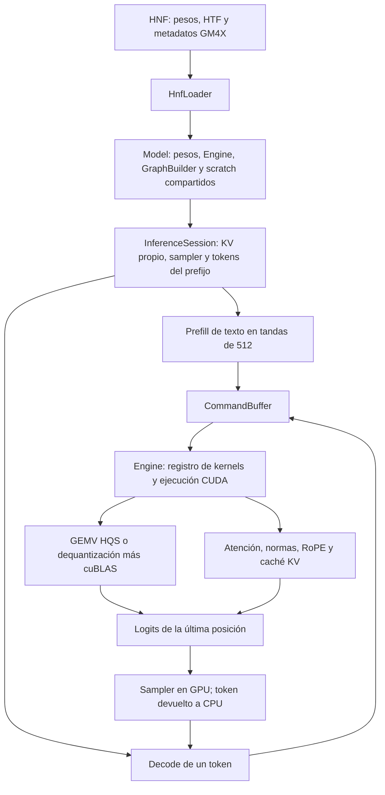

# Héctor: arquitectura y prioridades de rendimiento

Revisión local del 19 de septiembre de 2026, sobre `fdc99e5`.
GPU: RTX 4070 Ti, 60 SM, 12.282 MiB. Driver 595.91.07; biblioteca
compilada en Release con CUDA 13.1 y arquitectura nativa.

Este documento conserva la auditoría del estado anterior al parche. La
implementación y su validación posterior están en
[KV y grafos: hito de implementación](OPTIMIZACION_KV_GRAFOS_2026-09-19.md).

## Resultado principal

Hay margen real sin reducir más la precisión de los pesos. Los dos frentes
mejor respaldados son **activar correctamente los grafos en InferenceSession**
y **optimizar la atención, tanto en prefill como en decode largo**.

La ruta usada por `helios_formatted` intenta capturar sobre el stream CUDA
por defecto: la captura falla y se ejecutan los kernels individualmente.
Nsight registra 127 fallos de captura, código 900, para 128 tokens generados.
Una variante temporal con stream dedicado y recaptura por turno mejora las
muestras aproximadamente un 5–9 %, conservando longitud y huella del texto
en los tres prompts. No es todavía un parche listo para producción.

La caída con contexto largo tiene una causa medida: entre el prompt de 41
tokens y el de 6.185, la atención pasa de 0,475 a 6,390 ms por token; las
multiplicaciones de pesos apenas cambian, de 19,661 a 19,828 ms. En el
prefill de 6.185 tokens, la atención representa el 64,4 % del tiempo de kernels.

Esta revisión añade documentación e instrumentos aislados. No cambia los
fuentes de producción, los pesos, la configuración de Hexos ni sus binarios.

## 1. Mapa de la arquitectura que realmente se ejecuta



- **Carga:** `src/hnf_loader.cpp` interpreta bloques, tensores, tokenizer y
  metadatos; `TensorRegistry` registra direcciones y propiedad de memoria.
  Para el HNF ensayado, los pesos de texto están en GPU. El embedding también
  se usa como proyección de salida: no hay una segunda `lm_head` duplicada.
- **Modelo compartido:** `src/inference_session.cpp:88` contiene pesos,
  Engine, GraphBuilder, scratch y adaptador visual. Las sesiones comparten
  esos recursos y un mutex serializa turnos completos.
- **Sesión:** mantiene KV, namespace de tensores, sampler, prefijo tokenizado
  y CommandBuffer de decode. El objeto CUDA Graph ejecutable, sin embargo,
  pertenece a Engine, no a cada sesión.
- **Construcción:** hay una ruta genérica y una ruta explícita para Gemma 4
  (`src/graph_builder.cpp:696`). No es exacta la descripción antigua de una
  única ruta sin particularidades de arquitectura.
- **Prefill:** tandas de 512 tokens, construcción del grafo de comandos por
  tanda, dequantización de matrices HQS a un buffer FP16 y multiplicación
  mediante cuBLAS. Se calculan logits solo de la última posición de cada
  tanda, una optimización ya presente.
- **Decode:** `forward_one`, copia del token a GPU, posición en device,
  forward de un token y sampler. HQ4.2K/HQ5.2K usan GEMV directo sobre
  pesos comprimidos; no expanden toda la matriz a FP16 en decode.
- **Muestreo:** greedy o top-k/top-p en GPU. La devolución de un entero a
  CPU sincroniza cada token. La antigua descripción de softmax en CPU ya no
  corresponde a esta ruta.
- **Visión:** adaptador separado, con mecanismos de staging de pesos mapeados
  y doble buffer opcional. No se ha medido visión en esta auditoría.
- **Frontera con Hexos:** `tools/helios_formatted.cpp` comparte pesos entre
  sesión principal y auxiliar de 1K. Acumula los fragmentos y devuelve la
  respuesta completa al terminar: importa para la futura revisión de latencia
  percibida, aunque no explica el coste del kernel de atención.

El README y partes de `OPTIMIZATION_NOTES.md` son históricos. Las conclusiones
de esta revisión proceden del código actual y de mediciones nuevas.

## 2. Modelo y memoria

HNF: `helios_convert_v9.1/output/gemma4_12b_hq42_hq52.hnf`.
SHA-256: `429785268c93f544174e9e2deb90a93a8c9df6c63a7c006ffdf5076d2a0ce765`.

Geometría contrastada con el config local y GM4X:

| Propiedad | Valor |
|---|---:|
| Capas | 48: 40 locales y 8 globales |
| Hidden / MLP | 3.840 / 15.360 |
| Cabezas Q | 16 |
| Cabezas KV / dimensión local | 8 / 256 |
| Cabezas KV / dimensión global | 1 / 512 |
| Ventana local | 1.024 |
| Vocabulario | 262.144 |
| PLE / capas KV compartidas | No / 0 |
| Capas con proyección K=V | 8 globales |

Inventario real: 337 tensores FP16, 144 HQ4.2K y 185 HQ5.2K.
Los datos de tensores suman 7.497.711.200 bytes. El embedding compartido
ocupa 723.517.440 bytes, aproximadamente 690 MiB.

Con contexto máximo 16.384 y prefill 512, el KV FP16 principal se calcula así:

- Local: `40 × 1536 × 8 × 256 × 2(K,V) × 2 bytes` = **480 MiB**.
- Global: `8 × 16384 × 1 × 512 × 2 × 2 bytes` = **256 MiB**.
- Total principal: **736 MiB**. La sesión auxiliar de 1K añade **336 MiB**.

El anillo ya evita reservar contexto completo en las 40 capas locales.
Cuantizar KV podría ahorrar memoria y tráfico, pero requiere verificar la
calidad; no es necesario empezar por ahí para ganar velocidad.

Otros puntos de memoria:

- El buffer de dequantización de cuBLAS se reserva perezosamente y persiste:
  el crecimiento inicial no equivale a una fuga por token.
- Su propietario y el handle cuBLAS son estáticos globales
  (`kernels/matmul_cublas.cu:29`). El mutex por Model no protege dos Model
  distintos ejecutándose a la vez. Antes de concurrencia real, moverlos a
  un contexto de ejecución con propiedad explícita.
- La presencia de metadatos visuales eleva reservas de scratch y anillo a
  partir del techo 6.144 aunque el turno actual sea de texto
  (`src/inference_session.cpp:400,479`). Conviene reservar recursos visuales
  al necesitarlos y gestionar la invalidación de grafos al cambiar direcciones.
- `allocate_gemma4_scratch` aún reserva `g4.ple_projected` sin PLE: ahorro
  menor, de 3,75 MiB con tanda 512; no es una prioridad de velocidad.

## 3. Mediciones reproducibles

Se enlazó un harness contra la biblioteca actual y se llamó a **InferenceSession**,
la misma clase que usa el adaptador, sin Python ni React. Una sesión, contexto
máximo 16K, greedy, 128 tokens de salida, cierre de turno desactivado.
Prompts: instrucción larga precedida de 0, 128 o 384 repeticiones de una
frase técnica; producen 41, 2.089 y 6.185 tokens. No son un benchmark de calidad.

| Tokens de prompt | Prefill, segunda muestra | Decode base, dos muestras | Variante con grafos |
|---:|---:|---:|---:|
| 41 | 174,9 ms | 42,93 / 40,48 tok/s | 44,02 / 43,80 tok/s |
| 2.089 | 2.226,1 ms | 35,00 / 35,02 tok/s | 37,90 / 38,17 tok/s |
| 6.185 | 8.331,1 ms | 32,14 / 32,46 tok/s | 34,66 / 34,38 tok/s |

Otra ejecución base previa dio 41,00–42,49, 35,15–35,37 y 32,54–32,62 tok/s.
La mejora de grafos es preliminar: dos muestras por caso, orden no aleatorizado,
GPU compartida con escritorio y sin fijar relojes. No justifica prometer un
porcentaje universal. La variante captura 1.109 comandos.

En cada caso coinciden la longitud y la huella FNV-1a de la respuesta entre
base y variante, y entre repeticiones. Esto es un control de regresión de
texto limitado: no sustituye comparación de IDs, logits ni pruebas de sesiones.

La VRAM total observada durante la prueba ronda 9.489–9.526 MiB; incluye el
escritorio. El harness tiene una sola sesión, por lo que no debe compararse
directamente con el proceso del agente y sus dos KV.

### Perfil del decode con Nsight

Trazas independientes de los cronometrajes anteriores, limitadas al decode.
Porcentajes sobre la suma de duraciones de kernels; no sobre tiempo de pared.

| Familia | Contexto corto | Contexto de unos 6,2K |
|---|---:|---:|
| GEMV cuantizado | 19,661 ms/token · 88,23 % | 19,828 ms/token · 69,86 % |
| Atención | 0,475 ms/token · 2,13 % | 6,390 ms/token · 22,51 % |
| RMSNorm | 1,536 ms/token · 6,89 % | 1,592 ms/token · 5,61 % |
| Argmax | 0,173 ms/token | 0,131 ms/token |
| Todos los kernels | 22,283 ms/token | 28,382 ms/token |

En ambas trazas: **148.224 kernels / 128 tokens = 1.158 kernels por token**.
Hay 127 llamadas a `cudaStreamBeginCapture` con retorno 900 y ningún replay
efectivo. El código ignora ese fallo inicial y vuelve a ejecutar normalmente.

La subida de atención se reparte entre llenar la ventana local y alargar la
global. Agrupando sus lanzamientos en el orden de las 48 capas: local pasa de
0,387 a 2,848 ms/token; global de 0,088 a 3,542 ms/token.

El elevado tiempo de API atribuido a `cudaMemcpyAsync` **incluye esperas por
el trabajo GPU previo**. No demuestra que copiar cuatro bytes sea el cuello
de ancho de banda PCIe. El resultado CPU del sampler se reserva con `new`,
no como memoria fijada; cambiarlo tampoco elimina la dependencia autoregresiva.

### Perfil del prefill de 6.185 tokens

| Familia | Tiempo GPU | Porcentaje aproximado |
|---|---:|---:|
| Atención cached de prefill | 5,336 s | 64,4 % |
| Dequantización HQ4.2K + HQ5.2K | 1,428 s | 17,2 % |
| GEMM de cuBLAS | alrededor de 1,32 s | alrededor de 15,9 % |

Por tanto, acelerar solo la dequantización no resuelve la mayor parte del
tiempo hasta el primer token. La prioridad del prefill es la atención.

## 4. Hallazgos y orden de trabajo

### P0: corregir la validez del KV antes de ampliar la reutilización

`src/inference_session.cpp:615` permite retroceder al prefijo común mientras
`prefix_usable()` solo comprueba longitud de tokens. El anillo conserva únicamente
sus últimas ranuras físicas; `Gemma4KVCache::rewind_to` mueve el contador.

Ejemplo deducido del layout: después de 7.000 tokens, un anillo de 1.536
conserva posiciones 5.464–6.999. Si el prompt cambia cerca del token 1.000,
retroceder allí no recupera las claves antiguas que necesita la ventana local.
Los kernels pueden leer datos de posiciones posteriores bajo índices antiguos.

**Propuesta:** comprobar por capa que toda la ventana requerida sigue residente;
si no lo está, reconstruir el prefijo desde un estado válido o reiniciar y
prefillear el prompt completo. No basta con comparar el vector de IDs en CPU.
La condición debe cubrir también reintentos tras errores y rollback de tandas.

**Validación pendiente:** comparar logits y generación con sesión fresca tras
editar un prefijo anterior al anillo, después de más de 1.536 tokens.
El defecto de validez se identifica por código/layout; no se atribuye a él
ninguna respuesta concreta observada anteriormente por el usuario.

### P1: grafos reales con propiedad correcta por sesión

`Model::load` crea Engine con `EngineConfig.stream == nullptr`
(`src/inference_session.cpp:357`, `src/engine.hpp:70`). La prueba mínima
reproduce `graph_ready=0` en el stream por defecto y `graph_ready=1` en uno
dedicado. Nsight confirma el mismo fallo en la sesión real.

**No basta con añadir cudaStreamCreate:** `Engine::execute_graph_replay`
reproduce el único grafo válido sin comprobar qué sesión o CommandBuffer lo
solicita (`src/engine.cpp:175`). Si se activa captura sin más, puede reutilizar
direcciones KV de otra sesión. Además, el prefill cambia las formas activas
del scratch: hay que restaurar las formas de decode antes de recapturar.

**Propuesta:** stream con ciclo de vida explícito, grafo por sesión/identidad
de recursos o invalidación segura al cambiar de sesión, y telemetría de
captura/replay/fallback. Precalentar autotune antes de capturar. No reintentar
indefinidamente un error de captura conocido.

La variante temporal invalida y reconstruye decode al inicio de cada turno;
demuestra viabilidad, no resuelve toda la propiedad/lifetime. Su stream dura
hasta el fin del proceso. No debe aplicarse literalmente a producción.

**Aceptación:** mismas secuencias greedy, paridad de logits dentro de tolerancia,
sesiones A/B intercaladas de distintas capacidades, destrucción de sesiones,
prefill posterior al decode, reset y cancelación. Medir cinco o más muestras
calientes A/B antes de fijar el beneficio.

### P2: atención de prefill por tiles y decode dividido por KV

`kernels/attention.cu:669` usa un bloque por query/head, recorre posiciones
y hace softmax online, pero no reutiliza un tile KV entre varias queries ni
usa una multiplicación matricial por tiles para QK/PV. Tiene softmax online;
eso por sí solo no ofrece el rendimiento de una implementación tipo FlashAttention.

**Prefill:** diseñar tiles de queries/keys que reutilicen KV y aprovechen
Tensor Cores, manteniendo causalidad, ventana local, anillo, escala 1,
GQA/MQA y dimensiones 256/512. Es el mayor coste medido del prefill.

**Decode:** `launch_attention_cached_fp16_dp` lanza `batch * num_heads`
bloques (`kernels/attention.cu:507`): en este modelo, **16 bloques para 60 SM**.
Cada bloque recorre una partición larga del contexto con 16 warps.
Corrección de lectura del 19/09: el comentario histórico decía cuatro, pero
`ATTN_WARPS` ya valía 16 en el commit auditado.
Repartir KV entre más bloques y combinar estados de softmax puede aumentar
el paralelismo. Elegir número de particiones según longitud y geometría;
con contexto corto el coste de combinar puede superar la ganancia.

Microprueba aislada con caché caliente, 16 cabezas:

| Longitud | Local HD256, ventana 1.024 | Global HD512 |
|---:|---:|---:|
| 128 | 7,09 µs | 7,89 µs |
| 1.024 | 42,68 µs | 49,93 µs |
| 4.096 | 42,91 µs | 185,96 µs |
| 8.192 | 42,82 µs | 361,68 µs |
| 12.000 | 42,69 µs | 555,68 µs |

No extrapolar estos tiempos calientes al forward entero: el perfil real tiene
pesos y otros kernels entre atenciones. Los dos experimentos miden cosas distintas.

**Aceptación:** referencia numérica en HD256/512, MQA/GQA, longitudes 1/1023/1024/
1025/4096/8192/12000, wrap del anillo, prefill con pasado y regresión E2B/E4B.
Medir tiempo hasta primer token y decode por separado.

### P3: multiplicaciones y fusiones específicas de Gemma

Los GEMV dominan el decode corto. Antes de otra cuantización, perfilar por
forma HQ4.2K/HQ5.2K: MLP (K=3840,N=15360 y K=15360,N=3840), proyecciones
de atención y vocabulario (K=3840,N=262144). El autotune actual solo elige
entre tres configuraciones por forma/dtype/GPU. Versionar su caché también
por implementación evitaría conservar decisiones de kernels antiguos.

Hay trabajo redundante comprobable, de impacto menor que la atención larga:

- `src/graph_builder.cpp:790` calcula K y V con la misma matriz en las ocho
  capas globales K=V. Calcular una vez y copiar el resultado antes de sus
  normalizaciones distintas evita ocho matmuls. No se pueden aliasar los
  resultados finales: K recibe norma con pesos y RoPE; V, norma sin pesos.
- `append_gemma4_mlp_ple_tail` separa GELU y multiplicación. Ya existe
  `GELU_MUL`; verificar equivalencia de redondeo antes de conectarlo.
- La fusión Q/K/V y gate/up del loader **excluye Gemma explícitamente**
  (`src/hnf_loader.cpp:901`). El builder Gemma tampoco consume esos tensores.
  El hecho de existir la optimización para Qwen no implica que la use el 12B.
- Fusiones de normas, residuales y RoPE deben respetar la variante proporcional
  global, las postnormas y `layer_scalar`. No trasladar el kernel de Qwen tal cual.

No se promete duplicar tok/s con fusiones pequeñas: las sumas del perfil
acotan cuánto pueden aportar. Eliminar una matmul pequeña no ahorra lo mismo
que acelerar el MLP o la proyección al vocabulario.

### P4: prefill cuantizado y lotes pequeños

`kernels/matmul_hqs_compact.cu:31` fija umbral 9: con M=2–8 hace un bucle de
GEMV y relee pesos por token; con M>=9 expande la matriz a FP16 y usa cuBLAS.
El prototipo batcheado de `tools/gemv_batched_prototype.cu` no está integrado
en estos dispatches ni acredita rendimiento del HQ4.2K/HQ5.2K de este 12B.

**Propuesta:** GEMV batcheado para M pequeño y, para prefill grande, evaluar
GEMM con dequantización por tiles. Elegir ruta por forma y tamaño de lote,
no solo un umbral heredado. Conservar M=1 especializado.

La dequantización cuesta 17,2 % del prefill medido; hay una oportunidad real,
pero menor que la atención de prefill en este escenario. Barrer tamaños
de tanda después de mejorar kernels: subir 512 ciegamente cambia scratch,
capacidad del anillo y coste de atención.

### P5: muestreo, planificación y memoria como fases posteriores

- Argmax recorre 262.144 logits en un único bloque de 256 threads
  (`kernels/sampling.cu:69`). Una reducción en dos fases merece microbenchmark,
  pero aquí consume menos del 1 % del tiempo de kernels.
- Top-k también se resuelve en un solo bloque para el rango soportado. Medir
  con temperatura activa por separado; estas cifras son greedy.
- GPU sampling ya existe. Llevar RNG/posición y selección al grafo puede
  reducir trabajo host, pero no elimina la necesidad de gestionar EOS,
  cancelación y entrega incremental.
- Eliminar logits/sampling de tandas de prefill intermedias ahorra trabajo,
  aunque el perfil muestra que no es el coste dominante.
- Concurrencia, continuous batching, KV paginado y speculative decoding
  requieren trabajo estructural. No son el primer paso para acelerar un
  único chat de este 12B. Speculative necesita antes verificación batcheada
  barata, margen de memoria y rollback seguro del anillo.
- Nuevos formatos de pesos o KV deben aprobar calidad de código, razonamiento
  y conversación larga; NRMSE de pesos o una respuesta coherente no bastan.

## 5. Qué revisar después en Hexos

Una vez medido y estabilizado Héctor: tamaño y estabilidad del prefijo,
catálogo de herramientas por turno, generaciones auxiliares, reutilización
del KV, política de corte/resumen, reintentos y streaming entre adaptador,
Python y React. El presupuesto se debe descomponer en tokenización, prefill,
decode, herramientas y transporte. Esta auditoría no modifica esas políticas
ni atribuye tiempos nuevos al agente que no se hayan medido.

## 6. Evidencia y reproducción

Fuentes, logs y resúmenes: [auditoria-2026-09-19](auditoria-2026-09-19/).
`hashes.txt` identifica binario, biblioteca y modelo. El árbol estaba limpio
antes de añadir este informe. Las trazas grandes y SQLite originales permanecen
en `/tmp/hector-audit-20260919/`; los CSV resumidos se conservan con el informe.

Desde la raíz del repositorio:

```bash
bash informes/auditoria-2026-09-19/reproducir.sh probes
bash informes/auditoria-2026-09-19/reproducir.sh inventory /ruta/modelo.hnf
bash informes/auditoria-2026-09-19/reproducir.sh session /ruta/modelo.hnf
bash informes/auditoria-2026-09-19/reproducir.sh graph /ruta/modelo.hnf
```

El script crea un directorio temporal y usa la biblioteca existente; el modo
`graph` parchea una copia temporal de `inference_session.cpp`, nunca el original.
Requiere la biblioteca del commit auditado y permite cambiar CUDA mediante
`AUDIT_CUDA_ROOT`. Las mediciones GPU deben ejecutarse secuencialmente.

Para repetir perfiles sobre el harness compilado, usar `nsys profile
--trace=cuda --sample=none --cpuctxsw=none --capture-range=cudaProfilerApi
--capture-range-end=stop -o salida /ruta/session_bench /ruta/modelo.hnf profile`.
`AUDIT_REPEAT=384` selecciona contexto largo; añadir `AUDIT_PREFILL=1` captura
prefill en lugar de decode. `nsys stats --report cuda_gpu_kern_sum,cuda_api_sum
--format csv salida.nsys-rep` obtiene las tablas.

Límites: una GPU/modelo, prompts sintéticos, texto sin visión, dos muestras
por caso y control de salida por huella/longitud. No se ha validado llenar
todo el contexto, temperatura activa, varias arquitecturas ni sesiones
intercaladas con la variante de grafos. Los candidatos requieren sus propias
pruebas antes de integrarse.
